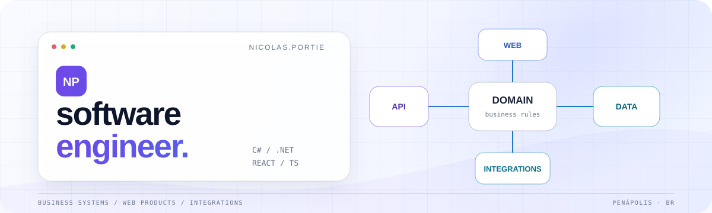

<picture>
  <source media="(prefers-color-scheme: dark)" srcset="./assets/header-dark.svg">
  <source media="(prefers-color-scheme: light)" srcset="./assets/header-light.svg">
  
</picture>

<h1 align="center">Nicolas Portie</h1>

  <strong>Engenheiro de software · C# / .NET · React / TypeScript</strong>
   
  Backend em .NET e interfaces web com React e TypeScript.

  
  
  
  

## Perfil

Desenvolvo sistemas web, APIs e integrações no ecossistema .NET. Antes de implementar, procuro entender como o processo funciona e quais regras o sistema precisa representar. A partir disso, defino os dados, a arquitetura e as integrações.

Também uso React e TypeScript em interfaces web, principalmente dashboards e fluxos operacionais.

## Áreas de atuação

<table>
  <tr>
    <td width="50%" valign="top">
      <h3>Backend orientado ao domínio</h3>
      APIs e serviços em C# e .NET para sistemas com regras de negócio e persistência de dados.
    </td>
    <td width="50%" valign="top">
      <h3>Produtos web</h3>
      Interfaces em React e TypeScript, de dashboards a fluxos operacionais.
    </td>
  </tr>
  <tr>
    <td width="50%" valign="top">
      <h3>Integrações e automação</h3>
      Comunicação entre sistemas e automação de processos que antes dependiam de trabalho manual.
    </td>
    <td width="50%" valign="top">
      <h3>Software e hardware</h3>
      Aplicações que recebem sinais de dispositivos, validam acessos e mostram a operação em tempo real.
    </td>
  </tr>
</table>

## Stack

  <picture>
    <source media="(prefers-color-scheme: dark)" srcset="https://skillicons.dev/icons?i=cs,dotnet,ts,react,nextjs,vite,postgres,redis,docker,git&theme=dark&perline=10">
    <source media="(prefers-color-scheme: light)" srcset="https://skillicons.dev/icons?i=cs,dotnet,ts,react,nextjs,vite,postgres,redis,docker,git&theme=light&perline=10">
    
  </picture>

| Backend | Web | Dados e entrega |
| :--- | :--- | :--- |
| C#, .NET 8+, ASP.NET Core, Entity Framework Core | TypeScript, React, Next.js, Vite, GSAP | SQL Server, PostgreSQL, Redis, Docker, Git |

## Contato

Para conversar sobre desenvolvimento de software ou oportunidades profissionais, escreva para [contato@nicolasportie.com](mailto:contato@nicolasportie.com) ou fale comigo pelo [LinkedIn](https://www.linkedin.com/in/nicolasportie).
